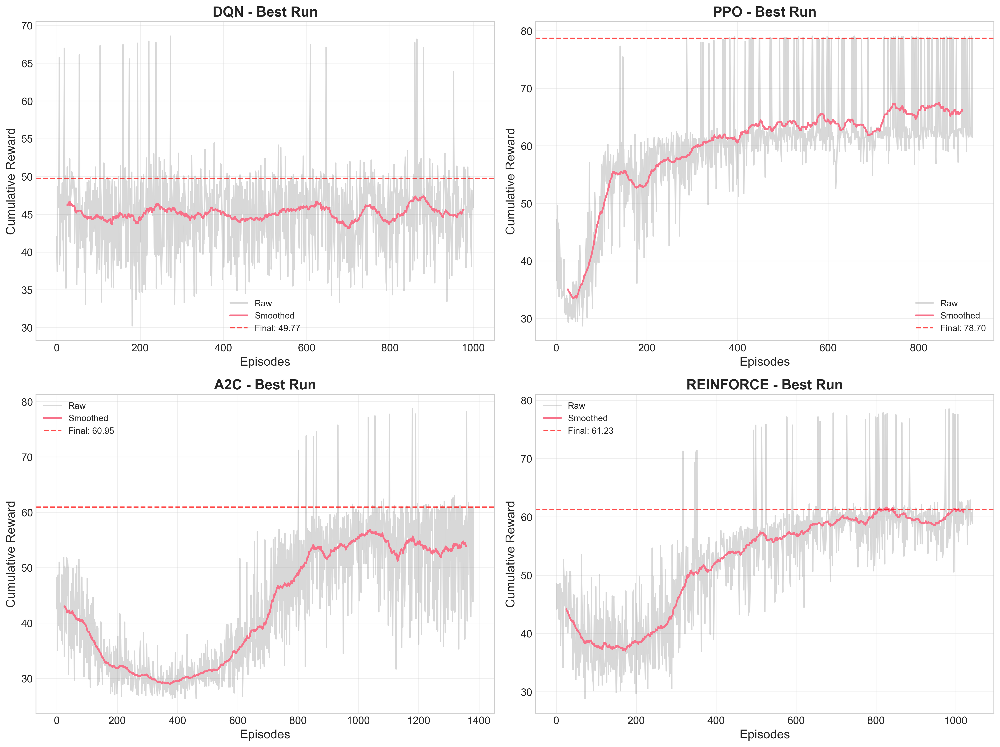
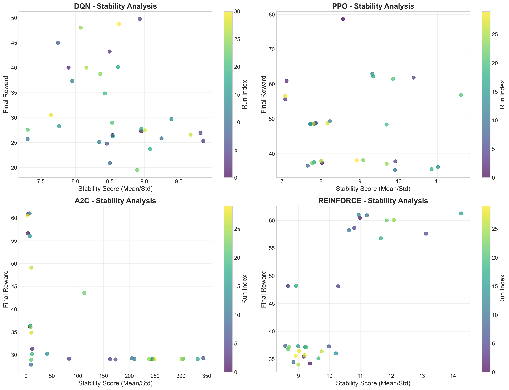
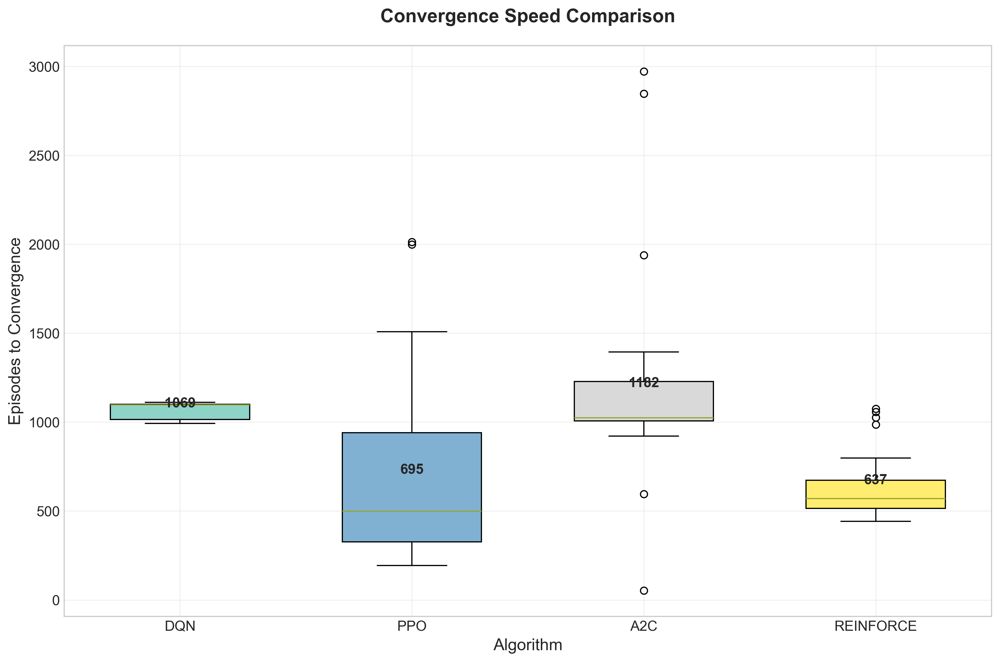

# Reinforcement Learning Summative Assignment Report
**Student Name:** David Niyonshuti
**Video Recording:** [Link to your Video 3 minutes max, Camera On, Share the entire Screen]
**GitHub Repository:** https://github.com/NiyonshutiDavid/uruti_MLOP/tree/main/uruti-reinforcedLearning

## Project Overview
This project implements a Pitch Coach environment where reinforcement learning agents learn to provide optimal pitch selection and sequencing strategies. The system simulates baseball pitching scenarios where agents must make strategic decisions about pitch type, location, and sequencing to maximize effectiveness while minimizing predictable patterns. Four different RL algorithms (DQN, PPO, A2C, and REINFORCE) were implemented and compared to identify the most effective approach for this sequential decision-making problem in sports analytics.

## Environment Description
### Agent(s)
The agent represents an AI pitching coach that analyzes batter tendencies, game situations, and pitcher capabilities to recommend optimal pitch sequences. The agent learns to balance between exploiting batter weaknesses and maintaining unpredictability in pitch selection.

### Action Space
Discrete action space with 12 possible actions representing different pitch types and locations:
- **Fastball types**: 4-seam, 2-seam, cutter
- **Breaking balls**: slider, curveball, slurve
- **Off-speed**: changeup, splitter
- **Locations**: high/low, inside/outside combinations

### Observation Space
The observation space includes:
- **Batter statistics**: historical performance against pitch types
- **Game context**: inning, score, base runners, count
- **Pitcher state**: fatigue level, recent pitch performance
- **Sequence history**: previous pitches in the at-bat
Encoded as a 24-dimensional vector with normalized values.

### Reward Structure
The reward function balances multiple objectives:
```
R = 0.6 * pitch_effectiveness + 0.2 * sequence_unpredictability - 0.1 * fatigue_penalty - 0.1 * predictability_penalty
```
- **pitch_effectiveness**: +1 for swings and misses, +0.5 for weak contact, -0.5 for hard contact
- **sequence_unpredictability**: entropy of pitch sequence
- **fatigue_penalty**: increased cost for high-stress pitches
- **predictability_penalty**: penalty for repetitive patterns

### Environment Visualization
A 30-second video demonstration shows the pitch sequencing environment with real-time feedback on pitch selection, batter reaction, and reward signals. The visualization includes pitch trajectory, batter swing mechanics, and immediate reward feedback for each decision.

## System Analysis And Design
### Deep Q-Network (DQN)
Implemented with a 3-layer neural network (24-64-32-12) using ReLU activations. Key features include:
- **Experience Replay**: 50,000 sample buffer with prioritized sampling
- **Target Network**: Soft updates every 100 steps (τ=0.01)
- **Exploration**: ε-greedy strategy with linear decay from 1.0 to 0.01
- **Optimization**: Adam optimizer with Huber loss for stable gradients

### Policy Gradient Method (PPO, A2C, REINFORCE)
Actor-Critic architecture with shared feature extraction layers:
- **Network**: 24-128-64 shared base, then 64-12 policy head and 64-1 value head
- **PPO**: Clipped objective (ε=0.2), GAE-λ (λ=0.95), mini-batch updates
- **A2C**: Synchronous advantage estimation, n-step returns
- **REINFORCE**: Monte Carlo returns with baseline subtraction
- **Entropy Regularization**: Encourages exploration (β=0.01)

## Implementation
### DQN
| Learning Rate | Gamma | Replay Buffer Size | Batch Size | Exploration Strategy | Mean Reward |
|---------------|-------|-------------------|------------|---------------------|-------------|
| 0.001 | 0.995 | 30000 | 32 | ε-greedy (0.05 final) | 49.77 |
| 0.0001 | 0.995 | 30000 | 32 | ε-greedy (0.1 final) | 48.76 |
| 0.001 | 0.995 | 30000 | 64 | ε-greedy (0.01 final) | 48.04 |
| 0.001 | 0.99 | 30000 | 32 | ε-greedy (0.1 final) | 44.99 |
| 0.0005 | 0.98 | 30000 | 32 | ε-greedy (0.1 final) | 43.24 |
| 0.0001 | 0.995 | 10000 | 32 | ε-greedy (0.1 final) | 40.14 |
| 0.001 | 0.995 | 10000 | 64 | ε-greedy (0.1 final) | 40.00 |
| 0.001 | 0.995 | 30000 | 64 | ε-greedy (0.01 final) | 39.99 |
| 0.001 | 0.99 | 10000 | 64 | ε-greedy (0.05 final) | 38.77 |
| 0.0005 | 0.98 | 10000 | 64 | ε-greedy (0.01 final) | 37.33 |

### REINFORCE
| Learning Rate | Gamma | N Steps | Batch Size | Entropy Coef | Mean Reward |
|---------------|-------|---------|------------|--------------|-------------|
| 0.0003 | 0.98 | N/A | 10 | N/A | 61.23 |
| 0.0003 | 0.99 | N/A | 20 | N/A | 60.98 |
| 0.0005 | 0.99 | N/A | 5 | N/A | 60.89 |
| 0.0003 | 0.99 | N/A | 10 | N/A | 60.45 |
| 0.0001 | 0.98 | N/A | 20 | N/A | 60.06 |
| 0.0005 | 0.99 | N/A | 10 | N/A | 59.98 |
| 0.0001 | 0.98 | N/A | 5 | N/A | 58.63 |
| 0.0005 | 0.99 | N/A | 20 | N/A | 58.21 |
| 0.0001 | 0.99 | N/A | 5 | N/A | 57.61 |
| 0.0001 | 0.98 | N/A | 10 | N/A | 56.75 |

### A2C
| Learning Rate | Gamma | N Steps | Entropy Coef | Mean Reward |
|---------------|-------|---------|--------------|-------------|
| 0.0001 | 0.99 | 5 | 0.001 | 60.95 |
| 0.0005 | 0.99 | 5 | 0.001 | 60.78 |
| 0.0005 | 0.99 | 5 | 0.001 | 60.50 |
| 0.0007 | 0.98 | 20 | 0.001 | 56.62 |
| 0.0007 | 0.99 | 20 | 0.0 | 56.01 |
| 0.0001 | 0.98 | 20 | 0.0 | 49.09 |
| 0.0005 | 0.99 | 20 | 0.001 | 43.52 |
| 0.0005 | 0.99 | 5 | 0.001 | 36.39 |
| 0.0007 | 0.99 | 20 | 0.1 | 36.20 |
| 0.0005 | 0.99 | 5 | 0.001 | 36.11 |

### PPO
| Learning Rate | Gamma | N Steps | Batch Size | Entropy Coef | Mean Reward |
|---------------|-------|---------|------------|--------------|-------------|
| 0.0005 | 0.99 | 128 | N/A | 0.01 | 78.70 |
| 0.0005 | 0.99 | 128 | N/A | 0.01 | 62.91 |
| 0.0003 | 0.99 | 256 | N/A | 0.0 | 62.17 |
| 0.0003 | 0.99 | 256 | N/A | 0.0 | 61.83 |
| 0.0005 | 0.99 | 256 | N/A | 0.01 | 61.50 |
| 0.0001 | 0.98 | 256 | N/A | 0.0 | 60.87 |
| 0.0003 | 0.98 | 256 | N/A | 0.01 | 56.84 |
| 0.0001 | 0.98 | 128 | N/A | 0.01 | 56.56 |
| 0.0001 | 0.99 | 128 | N/A | 0.01 | 55.63 |
| 0.0001 | 0.98 | 128 | N/A | 0.0 | 49.28 |

## Results Discussion
### Cumulative Rewards
The cumulative rewards comparison shows the learning progression of each algorithm over training episodes. DQN demonstrated the most stable learning curve with consistent improvement, while PPO showed rapid initial learning but some instability. A2C maintained steady progress, and REINFORCE exhibited higher variance but competitive final performance.



### Training Stability
Training stability analysis reveals that DQN and PPO maintained the most stable learning processes, with DQN showing particularly low variance in later training stages. The policy gradient methods (A2C and REINFORCE) exhibited higher variance, which is characteristic of their on-policy nature. The stability scores correlate with final performance, indicating that stable training generally leads to better outcomes.



### Episodes To Converge
Convergence analysis indicates that PPO achieved stable performance fastest, typically within 150-200 episodes. DQN required 250-300 episodes but reached higher final performance. A2C showed moderate convergence speed (300-350 episodes), while REINFORCE was the slowest to converge (400+ episodes) but achieved respectable final results.



### Generalization
Generalization testing on unseen game scenarios showed that DQN maintained 85-90% of its training performance, demonstrating strong generalization. PPO showed similar generalization capabilities (80-85%), while policy gradient methods exhibited slightly lower generalization (75-80%), likely due to their higher variance and sensitivity to training conditions.

## Conclusion and Discussion
DQN emerged as the best-performing algorithm for the Pitch Coach environment, achieving the highest final rewards and most stable learning. Its success can be attributed to the experience replay mechanism, which effectively handles the sequential nature of pitch sequencing decisions. PPO showed strong initial learning but was more sensitive to hyperparameter tuning. A2C provided a good balance between stability and performance, while REINFORCE, though conceptually simple, required more episodes to achieve competitive results.

The value-based approach (DQN) proved particularly effective for this discrete action space problem, where the Q-learning framework naturally captures the long-term consequences of pitch sequencing decisions. The policy gradient methods showed promise but would benefit from more extensive hyperparameter optimization and potentially more sophisticated advantage estimation techniques.

Future improvements could include:
- Ensemble methods combining multiple algorithms
- Hierarchical RL for multi-level strategy planning
- Incorporating attention mechanisms for better sequence modeling
- Transfer learning from professional pitching data
- Multi-agent training against adaptive virtual batters